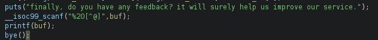
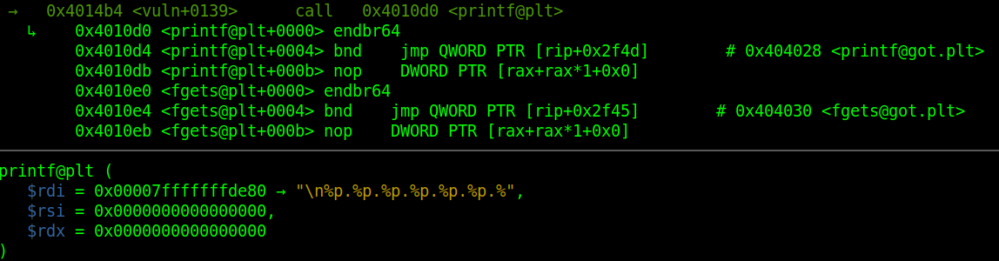
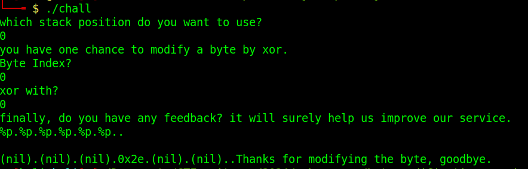
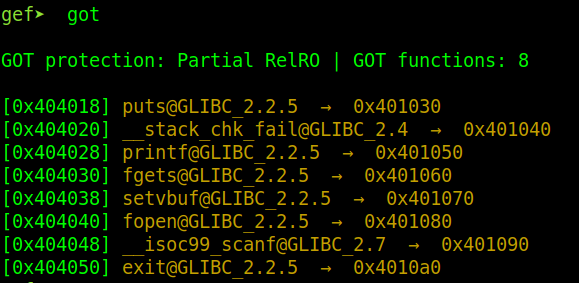
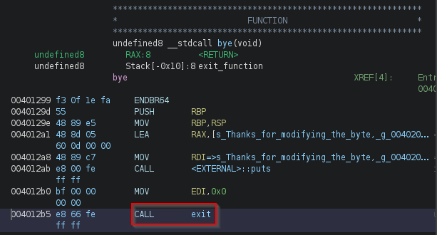
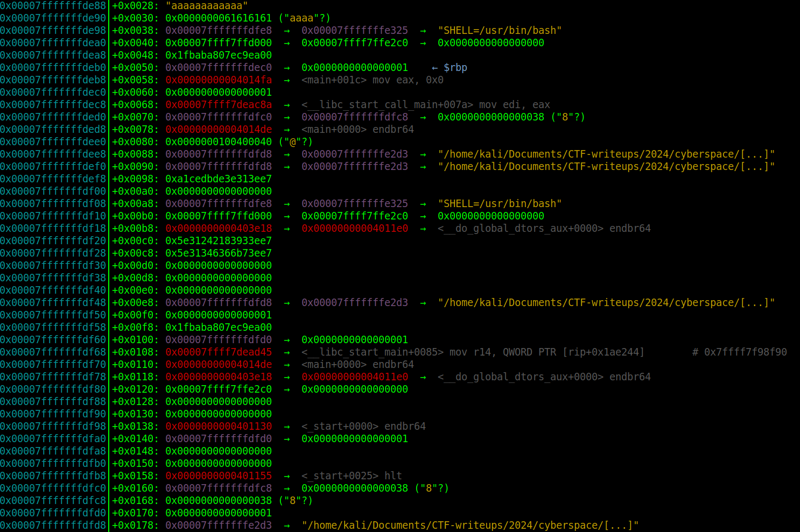
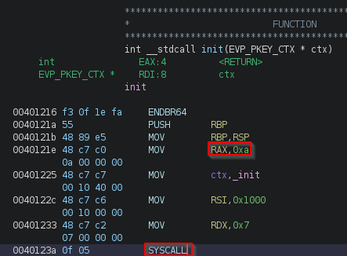
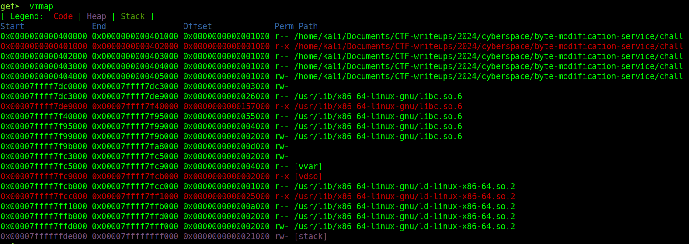
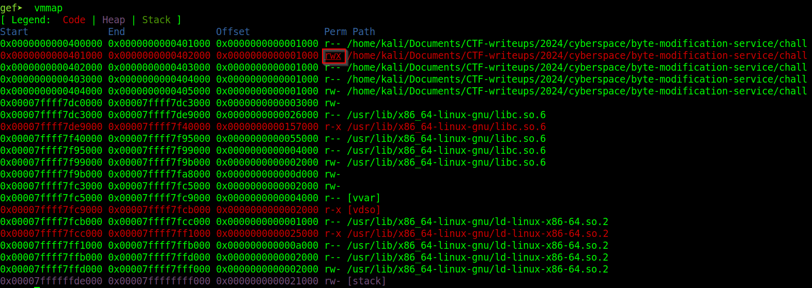
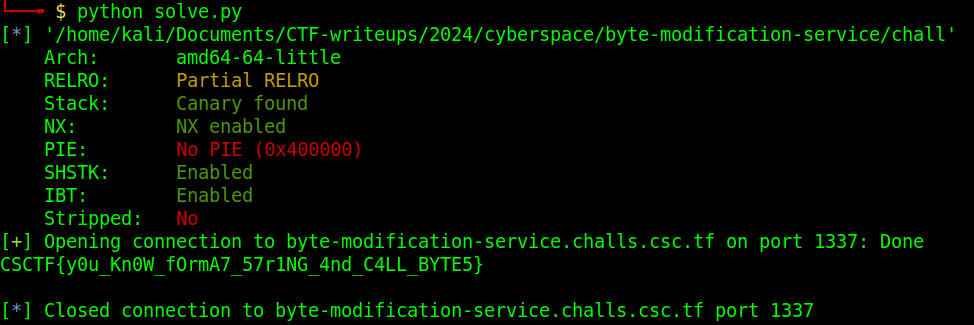

This was the first challenge in the pwn category, that ended up having the most number of solves, and we spent way longer on it than we should have :D tl;dr, format string vulnerability and writable .text section that makes it possible to overwrite instructions in the binary and execute the `win` function.

# Bug discovery

The binary seems to allow the user to modify an arbitrary byte on the stack after having copied the value to be modified in a local variable. So far so good, nothing vulnerable there per se.

The issue comes with the possiblity to leave any feedback:



20 bytes are read into a buffer (excluding any '@' character, we'll come back to this), so far also nothing bad about this. But then that buffer gets used with `printf` directly, which is the cause of the format string vulnerability. If the buffer contains any format specifiers like `%c`, `%p`, `%n`, they will be used on further addresses first in registers (rsi, rdx, rcx, r8, r9) and then from the stack to either read or write.





# First attempt at exploitation

Using this format string vulnerability, we would have an arbitrary read/write primitive, this is limited here by the number of characters read by scanf (20) and the fact that scanf won't read any '@' characters. Big deal I hear you say, but the binary is not compiled with PIE, so code addresses are not randomized and look like 0x40XXXX, and, you guessed it, 0x40 *is* the '@' character. That is a problem because the way format string vulnerabilites work is that we use the `%n` format specifier to write a certain number on an address that we usually specify in the same buffer; in this case we won't be able to put that address on the stack because of the `\x40` byte we'd need.

But then we think about what the binary allows us to do, that we said was not a vulnerability per se. It allows to copy an arbitrary stack 8-byte value from the stack into a local variable, and modify one of its bytes with a xor. So that's how we'll get our address on the stack! Let's just find what we actually want to write where, and then check the stack for suitable values that are one byte away from the target address, for example if we want to write at 0x705028 and there's 0x705038 on the stack, that's OK as we can modify the first byte with that xor primitive.

```shell
$ ./chall
which stack position do you want to use?
0
you have one chance to modify a byte by xor.
Byte Index?
0
xor with?
0
```

The first idea would be a classic with format string vulnerabilites on linux when there's only partial RELRO, overwriting the GOT (global offset table) of a libc function to redirect to an address of our choice. The GOT contains the address of the libc function to be called, or the address of a stub contained in the PLT (procedure linkage table) that dynamically resolves that function and writes its address in the GOT. 



What to overwrite, well at the end of the `bye` function, there's a call to a function that calls `exit`, so that would be a prime target, and we could just overwrite the GOT entry with the address of the `win` function.



We'd just need to find an address on the stack that is one xor away from 0x404050, and well unfortunately, unless you have better eyes than we do, there is none:



There is something that is not too far from `puts@got` though!! Yes, but if we overwrite `puts` with `win`, what's gonna happen when the win function wants to display the flag with... `puts`?

So scratch that. This is where we failed to notice a very important detail that took us onto a longer path than was necessary :)

# The missing detail

Who looks at this innocent little function called `init`, just before the `vuln` function in main? Well we didn't, but if we had looked, here's what we would have seen:



A syscall! And not any syscall, a mprotect syscall:

```shell
$ syscall x64 0xa
For x64:
The instruction is syscall, the syscall register is rax, and the return register is rax
The registers for the arguments are: rdi, rsi, rdx, r10, r8, r9
The syscall is 0xa/10
The syscall function declaration is:
mprotect(void addr[.len], size_t len, int prot);
```

This basically makes the whole .text page writable, as you can see here, before the syscall:



and after the syscall:



Which means that the entire code section was now writable, which well it's not supposed to be. I think we noticed that and that for example now the PLT was writable, but didn't compute that the ENTIRE .text section was writable. And thus that one could *just* overwrite the call to `bye` in the `vuln` function and make it into a call to `win` instead :D The offset for the call still has to be computed (it's relative to RIP!), but that would be it, just `win` instead of `bye`!

But we went another way and decided to overwrite a byte in the PLT.

# Second attempt at exploitation

So with the knowledge that the PLT is writable, which is where GOT redirects where the `exit` function for example has not been resolved yet, we also realized that the `win` function is *straight* after the `bye` function in the binary. So near actually (and because of the call to exit that doesn't return), that ghidra even thinks it's the same function:

 

Which means, that if we somehow manage to *return* instead of calling `exit`, well the execution would continue straight into the `win` function. And so we went and overwrote the first byte of `exit@plt` with a `ret` instruction. Easy enough, right? Right? Well actually not, because this made the stack not 16 bytes aligned anymore, and libc didn't like that. So we need a `ret 0x8` instruction instead, which is a bit longer... And that works! We then return straight into `win` and the binary prints us the flag :)



# Lessons learned

Next time we will take more time to check the little things! We knew we were missing something obvious because the challenge had a lot of solves already, but the small rabbit hole we went into was still nice and even though it made us waste some time we could have spent on other challenges, it was still worth a lesson learned!
