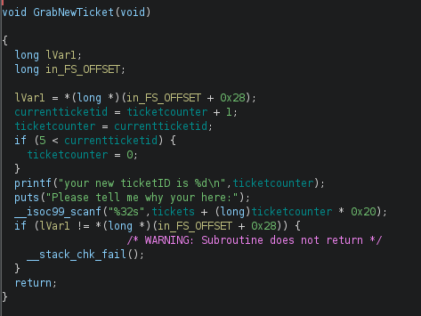
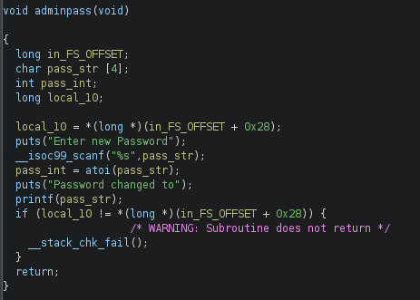
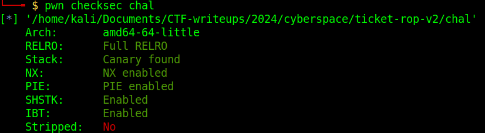
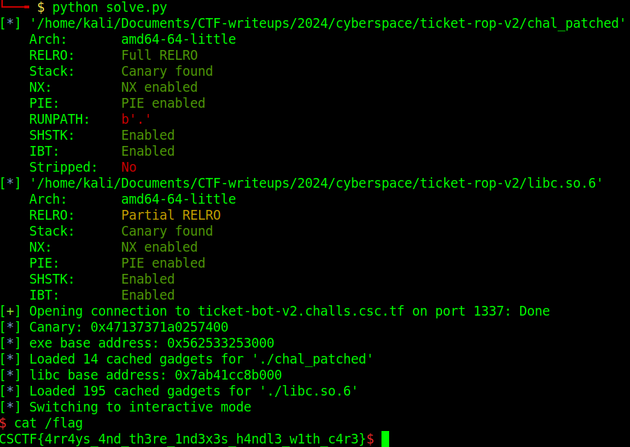

Second pwn challenge of the CTF, after having spent too much time on the first one, let's do things right this time. tl;dr, this one was straightforward, overwrite admin password in .data, leak stack canary, binary base, and libc base, ROP your way into a `system("/bin/sh")` call.

# Overview

The binary is pretty simple and allows us to create tickets, view tickets, and log in as admin. As it's unstripped, there's less reverse engineering to do as we have access to the function and variable names.

# Admin password overwrite

## Bug discovery

The password for the service login is 4 bytes coming from urandom that are written in .rdata, but as it so happens, the 4 bytes for the seed and the 4 bytes for the password (which is an int) are located straight after the tickets are allocated, of which there is place for 5:

```
-----------------------
| TICKET 0 (40 bytes) |
-----------------------
-----------------------
| TICKET 1 (40 bytes) |
-----------------------
-----------------------
| TICKET 2 (40 bytes) |
-----------------------
-----------------------
| TICKET 3 (40 bytes) |
-----------------------
-----------------------
| TICKET 4 (40 bytes) |
-----------------------
---------------------------------------
| SEED (4 bytes) | PASSWORD (4 bytes) |
---------------------------------------
```

So the idea will probably be to overwrite this password when creating a ticket. This is doable because of a very messy implementation of the current ticket index in the `GrabNewTicket` function:



The issue here is actually an off-by-one vulnerability, especially that line:

```c
if (5 < currentticketid) {
    ticketcounter = 0;
}
```

It checks if `currentticketid` is *greater* than 5, whereas it should check if it's  either greater or equal to 5 or greater to 4, the index starts at 0, so `currentticketid` 4 would already be the 5th and last ticket. And remember, after the last ticket comes... the password.

## Exploitation

Exploitation was straight forward in this case as all we need to do is to create 5 tickets (initial ticket included), and then write whatever we want to the `password` field of the 6th ticket, so bytes 5-8. Once we then supply that password (as int), we get access to the `AdminMenu`:

```shell
========================
1. change Admin Password
2. reset all Tickets
========================
```

# Code execution

## Bug discovery

Once in that menu, we have the option to change the admin password, which takes us to the `adminpass` function:



Here, a new password is read into a char array that is 4 bytes long, but the input is arbitrary: `scanf("%s", pass_str);` so we can probably overflow that buffer. 

On top of that, we also have a format string vulnerability when the new password is shown back (and the char array, not the int!) to the user with `printf`, which will help in the exploitation.

Let's check the exploit mitigations quick before we go further:



- Full RELRO, so no overwriting GOT as it is now not writable anymore as the addresses to the libc functions are resolved at the start
- NX, so no old school shellcode execution on the stack
- PIE, so the base address of the binary will be randomized
- Canary found, so we can't just overflow and overwrite the return address on the stack

## Exploitation

We then need a number of leaks, first the canary, then the return address so that we can infer the base address of the binary, but also the base address of libc somehow if we want to have access to good ROP gadgets. Once we have all that, we can ret2system in libc and have a remote shell.

The canary and return address leaks are easy thanks to the format string vulnerability, we can just printf those from the stack directly, respectively at offsets 8 and 9, so we can use `%8$p` and `%9$p` to print them directly. Once we have the canary and the base address of the binary, we can begin ROP with functions in the main binary.

```shell
[*] Canary: 0x89f36dd986dc5800
[*] exe base address: 0x58a27ba33000
```

To leak a libc address, we had to use a custom ROP chain to print the value in `puts@got` with `puts` itself (remember that the values in the GOT are the true addresses of the functions in libc). With pwntool, it's as easy as `rop.puts(exe.got['puts']`, but under the curtain this is what's happening, with a call to `adminpass` at the end, as we're not finished yet and need one more password change:

```
0x0000:           0x18d3 pop rdi; ret
0x0008:           0x3f68 [arg0] rdi = got.puts
0x0010:           0x1124 puts
0x0018:           0x16d4 adminpass()
```

We basically use a `pop rdi` gadget to put `puts@got` as first argument to `puts` (remember the first argument is passed in RDI, not on the stack for x64 linux), which then prints the leaked libc address.

The last part of exploitation is the main ROP chain, again very simple with pwntools in two lines, now that we can look for gadgets in libc:

```python
bin_sh = next(libc.search(b'/bin/sh'))
rop.system(bin_sh)
```

Add a `ret` gadget before that for stack alignment, and you got yourself a shell on the remote server (that needs a few tries admittedly for some reason):


